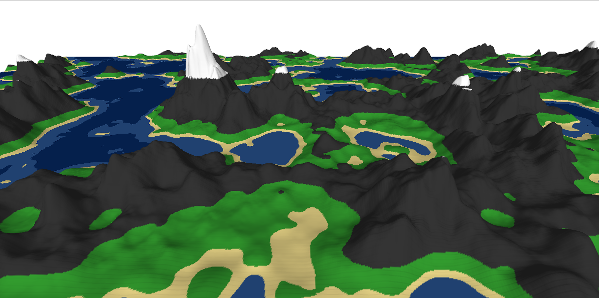

# Procedural Terrain Generation

### Example Screenshot

### Infos
I am sing Processing.org (java) for displaying the terrain.
 
In this screenshot, I use hypervalues of
octaves = 3
lacunarity = 2
persistance = 0.6

For the base octave, I use f(x)=x^3 as an easing function to get these flat beaches and high mountains.
